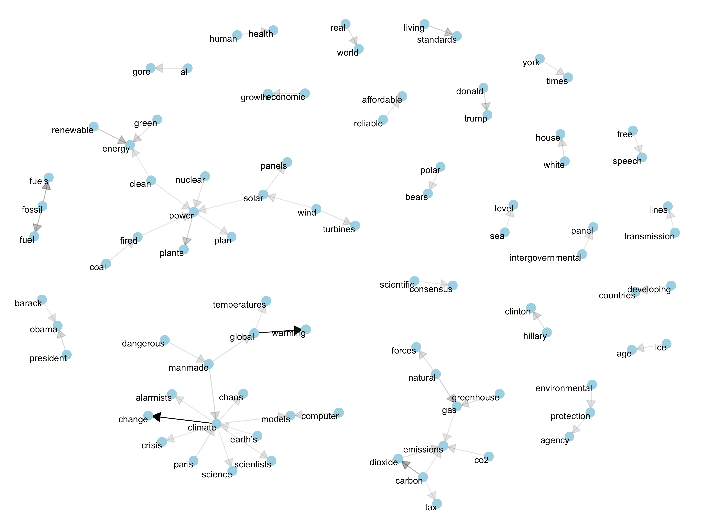

## An analysis of the frames and language about climate science used by conservative media outlets

### Network visualization of bigrams

As a preliminary result for the proposal submitted for [The Data Incubator](http://thedataincubator.com)'s fellowship, here I present a graph that visualizes the network of bigrams for the 10 columnists who have most written about climate change in the conservative website [townhall.com](http://townhall.com). The graph follows the process described by Silge and Robinson in their book [Text Mining with R](http://tidytextmining.com/).

    

Although this represents merely the first step in the analysis, we can already see some interesting information in this graph. There is (towards the left of the graph) a large sub-network that seems to focus on ideas of energy, which indicates that this is a central element in the conservative discourse on climate change. It is also worth noting other kinds of terms that appear together quite often. Many of them have to do with political discussions in the United States (Hillary Clinton, Barack Obama, White House, Donald Trump), which suggests the politicization of the topic. Others, such as the appearance of 'polar bears' as a bigram, indicates the importance that some imagery about climate change and what is seen to imply, are very present in the articles written by Townhall columnists. This already suggests several avenues for future exploration though other techniques, such as topic modeling (see [Part 2 of this topic proposal](/the-data-incubator-2)), sentiment analysis, or tf-idf.