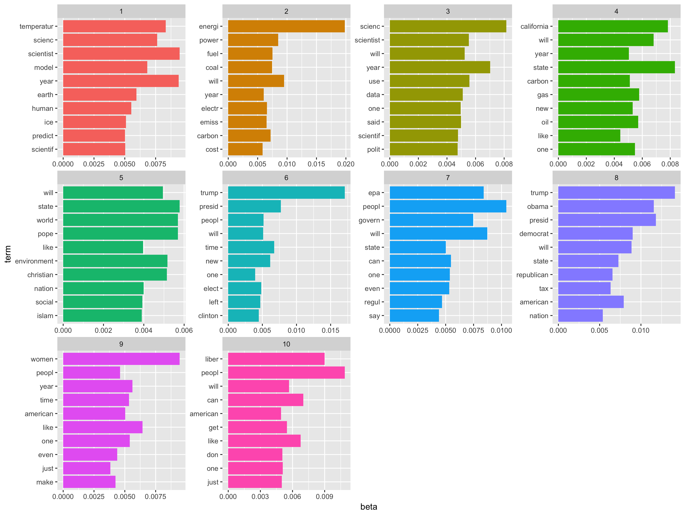

## An analysis of the frames and language about climate science used by conservative media outlets

### Topic modeling

Following on the preliminary analysis presented in [Part 1 of this topic proposal](../the-data-incubator-1) of my project proposal submitted for [The Data Incubator](http://thedataincubator.com)'s fellowship, here I show the terms most associated with the top 10 topics derived from topic modeling the entire body of articles dealing with climate change published by columnists in the conservative website [townhall.com](http://townhall.com) (n = 464 articles).

    

It is interesting to note, once again, the politicization of climate change, which is clearly the theme behind topic 8. Similarly to what we saw in [Part 1](../the-data-incubator-1), there is a topic focused on energy issues, with coal as a prominent term. And it is also worth mentioning the focus on science and scientific issues on topic 3, which suggests the value of further exploring the controversy over the science of climate change and how it is seen by conservative writers. Finally, we should also pay attention to topic 7, which seems to revolve around the issue of regulation and environmental policy by the state, as indicated by the presence of the EPA (Environmental Protection Agency) as a key term.

Once again, although very preliminary, this analysis already provides us with a high-level map of conservative language around climate change, and suggests further questions and areas to explore on this all-important issue.