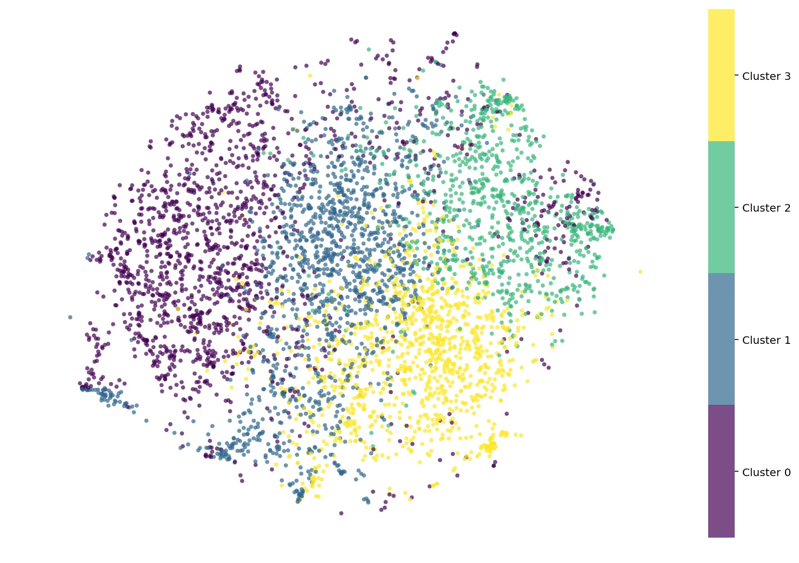

### Visualitzation of clusters with t-SNE

After finding the four clusters with K-Means, it is useful to visualize the clusters to see if they really appear as distinct. However, the data used to create the clusters contains 218 dimensions, which is clearly impossible to visualize. In order to make address this, I used the t-SNE algorithm to reduce the data to 2 dimensions, which makes it possible to visualize. After the data are plotted, I indicate each of the four clusters with a different color, which is assigned to the cluster labels produced through the K-Means clustering process.

    

It is interesting to see that the clusters are clearly visible, which confirms that the clustering process worked even when checked under a much lower dimensionality than that of the data used to produce it. We do detect some overlap between the points of some groups, which could be due to the lower number of dimensions, but also to the fact that the choice of four clusters was made by substantive reasons, i.e., trying to find the number of groups that would provide meaningful results that could be applied to Instacart's shopping process, and not by following any automatic number of clusters that would ensure the separation of the groups.