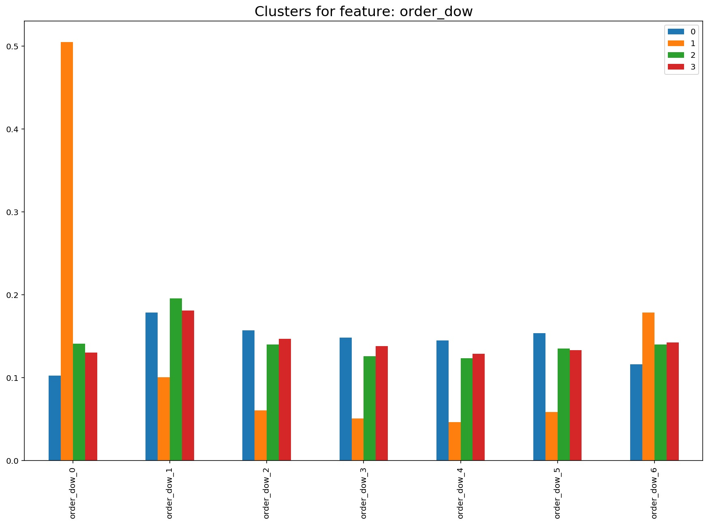

### Distribution of orders by day of week for four consumer clusters

As a preliminary result for the proposal submitted for [The Data Incubator](http://thedataincubator.com)'s fellowship, here I present a graph that visualizes the distribution of the orders by day of the week for four clusters found using the K-Means clustering algorithm on the Instacart order data (which can be found [here](https://www.instacart.com/datasets/grocery-shopping-2017)).

    

Although this represents merely the first step in the analysis, we can already see some interesting information in this graph. There is one cluster (cluster 1, in orange), that groups customers who disproportionately shop on Sundays and, to a lesser extent, on Saturdays. These are the weekend shoppers. Of the other three clusters, we find the opposite with cluster 0 (in blue), whose members order less on weekends than on weekdays. Finally, the other two clusters are similar in how they purchase throughougt the week, with a pretty stable distribution but a peak on Mondays. I expect these clusters to differ when it comes to other features of the ordering experience.

The value of this information for Instacart is clear: if we know and can identify our customers early in the shopping experience, we can then tailor it to them. In this case, for instance, we might want to follow up with the customers who shop in the weekends with an email on Saturday morning to remind them that they can do their shopping easily online, while we can makr sure that we do not bother those customers who tend to do their shopping on weekdays.